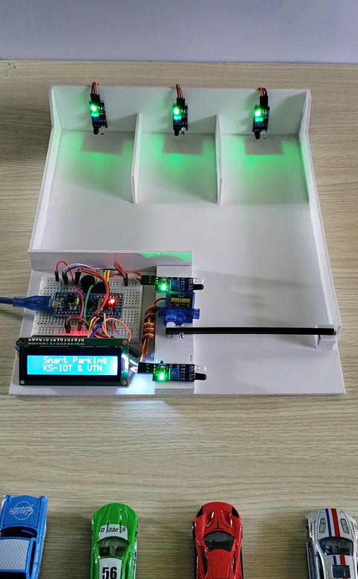
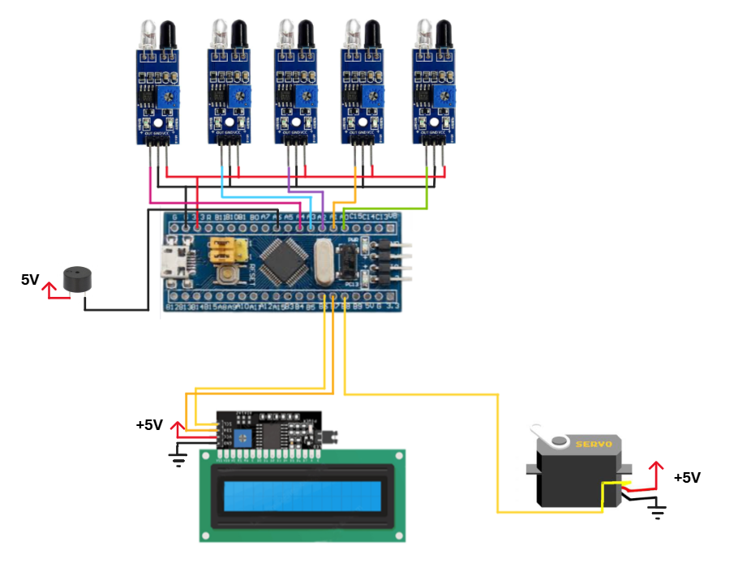
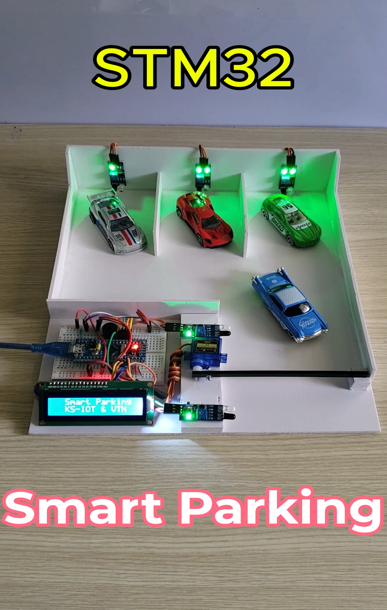

# 🚗 STM32 | Smart Parking System

Author: **Kael Shelby** (VTN)

## 📖 1. Introduction
- This project implements a smart parking system using the STM32F103C8T6 microcontroller.
- The system manages 3 parking slots, automatically controls entry/exit, and displays status and alerts via LCD and buzzer.

<div align="center">
  
</div>

## 🛠️ 2. Hardware Requirements
To build this project, you will need:
- STM32F103C8T6 (Blue Pill)
- 5 × Infrared (IR) sensors
- LCD 16x2 with PCF8574 (I2C interface)
- Servo motor (SG90/MG90S or equivalent) → controls barrier gate
- Buzzer (active/passive) → alarm
- Stable 5V power supply
- Breadboard / PCB, jumper wires, resistors

## 🔌 3. Circuit Diagram


### Pin Mapping
| Device                  | Module Pin | STM32F103C8T6 | Description                        |
|-------------------------|------------|---------------|------------------------------------|
| **Buzzer**              | VCC        | 5V            | 5V power supply                    |
|                         | GND        | GND           | Common ground                      |
|                         | Signal     | PA6           | Control signal ON/OFF              |
| **Servo Motor**         | VCC        | 5V            | 5V power supply                    |
|                         | GND        | GND           | Common ground                      |
|                         | Signal     | PB8           | PWM for servo angle control        |
| **LCD 16x2 (I2C)**      | VCC        | 5V            | 5V power supply                    |
|                         | GND        | GND           | Common ground                      |
|                         | SDA        | PB7           | I2C Data                           |
|                         | SCL        | PB6           | I2C Clock                          |
| **IR Sensor – Slot 1**  | VCC        | 5V            | 5V power supply                    |
|                         | GND        | GND           | Common ground                      |
|                         | OUT        | PA0           | Detects vehicle in slot 1          |
| **IR Sensor – Slot 2**  | VCC        | 5V            | 5V power supply                    |
|                         | GND        | GND           | Common ground                      |
|                         | OUT        | PA1           | Detects vehicle in slot 2          |
| **IR Sensor – Slot 3**  | VCC        | 5V            | 5V power supply                    |
|                         | GND        | GND           | Common ground                      |
|                         | OUT        | PA2           | Detects vehicle in slot 3          |
| **IR Sensor – Entry**   | VCC        | 5V            | 5V power supply                    |
|                         | GND        | GND           | Common ground                      |
|                         | OUT        | PA3           | Detects vehicle entering parking   |
| **IR Sensor – Exit**    | VCC        | 5V            | 5V power supply                    |
|                         | GND        | GND           | Common ground                      |
|                         | OUT        | PA4           | Detects vehicle leaving parking    |

## 🎥 4. Demo and Results
👉 [Watch the demo video](https://www.tiktok.com/@kshelbyiot/video/7534904748999314696?is_from_webapp=1&sender_device=pc&web_id=7500959777037518344)

<p align="center">
  <a href="https://www.tiktok.com/@kshelbyiot/video/7534904748999314696?is_from_webapp=1&sender_device=pc&web_id=7500959777037518344">
    
  </a>
</p>


## 🚀 5. Getting Started
1. **Clone the project from GitHub**  
   ```bash
   git clone <url>
2. **Open the project with Keil C (uVision)**
- Main source file: main.c
3. **Connect hardware according to the diagram in Section 3**
4. **Flash the firmware using ST-Link V2 or USB-UART**
5. **Expected Results:**
- Real-time monitoring of 3 parking slots.
- Automatic barrier control using servo motor.
- Alerts via buzzer + LCD display.
- Track vehicle entry/exit via IR sensors.

## 🚀 6. Hướng Phát Triển Tương Lai
- Integrate RFID for vehicle authentication.
- IoT connectivity (ESP8266/ESP32) for remote monitoring.
- Support for multiple entry/exit gates.
- Web dashboard to display parking status online.